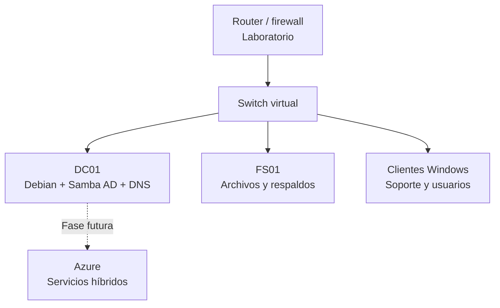

# Arquitectura inicial

## Propósito

Esta arquitectura representa una organización ficticia de aproximadamente 25 estaciones. Su primera fase permite practicar servicios locales de identidad, DNS y archivos; las fases posteriores estudiarán respaldo, monitoreo y evolución hacia Azure.

## Topología lógica

## Plan de red ficticio

| Elemento | Valor |
|---|---|
| Red de laboratorio | `10.20.0.0/24` |
| Puerta de enlace | `10.20.0.1` |
| DC/DNS principal | `10.20.0.10` |
| Servidor de archivos | `10.20.0.20` |
| Clientes por DHCP | `10.20.0.100-199` |
| Dominio AD | `fenixlab.test` |
| Nombre NetBIOS | `FENIXLAB` |

El dominio `.test` está reservado para pruebas y evita confusiones con dominios públicos reales.

## Componentes

### DC01

- Debian Linux.
- Samba Active Directory Domain Controller.
- DNS integrado con el dominio.
- Autenticación centralizada.
- Sin función de almacenamiento documental de usuarios.

### FS01

- Recursos compartidos por áreas ficticias.
- Permisos basados en grupos.
- Auditoría de accesos.
- Respaldo con política que se definirá y probará en una fase posterior.

### Clientes Windows

- Equipos unidos al dominio.
- Inicio de sesión con cuentas centralizadas.
- Validación de DNS, políticas y acceso a recursos.
- Casos de soporte documentados.

## Separación de áreas

Se crearán unidades organizativas y grupos para departamentos simulados:

- Administración.
- Finanzas.
- Operaciones.
- Soporte TI.
- Gerencia.

Los nombres de personas serán ficticios y ninguna contraseña se almacenará en el repositorio.

## Controles de seguridad previstos

- Principio de mínimo privilegio.
- Cuentas administrativas separadas de las cuentas de uso diario.
- Permisos mediante grupos, no asignaciones individuales.
- Registro y revisión de eventos.
- Copias de seguridad verificadas mediante restauración.
- Exclusión de secretos y evidencias sin anonimizar.
- Documentación de cambios e incidentes.

## Evolución hacia Azure

La fase híbrida será diseñada después de validar el laboratorio local. Se compararán, sin asumir equivalencias directas:

| Necesidad local | Servicio o enfoque a evaluar en Azure |
|---|---|
| Identidades locales | Microsoft Entra ID / Microsoft Entra Domain Services |
| Servidor de archivos | Azure Files |
| Copias de seguridad | Azure Backup |
| Monitoreo | Azure Monitor |
| Gobierno y cumplimiento | Azure Policy y RBAC |
| Conectividad híbrida | VPN Site-to-Site |

## Criterios de validación

La arquitectura se considerará implementada solo cuando existan pruebas reproducibles de:

1. Resolución DNS correcta.
2. Unión de un cliente Windows al dominio.
3. Inicio de sesión con un usuario de laboratorio.
4. Aplicación de permisos por grupo.
5. Registro de accesos.
6. Respaldo y restauración comprobados.

## Estado

Documento de diseño inicial. La topología todavía no representa una implementación completa; las evidencias se incorporarán conforme se ejecuten los laboratorios.
